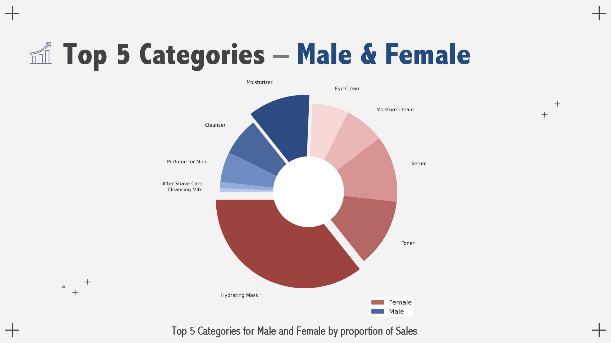
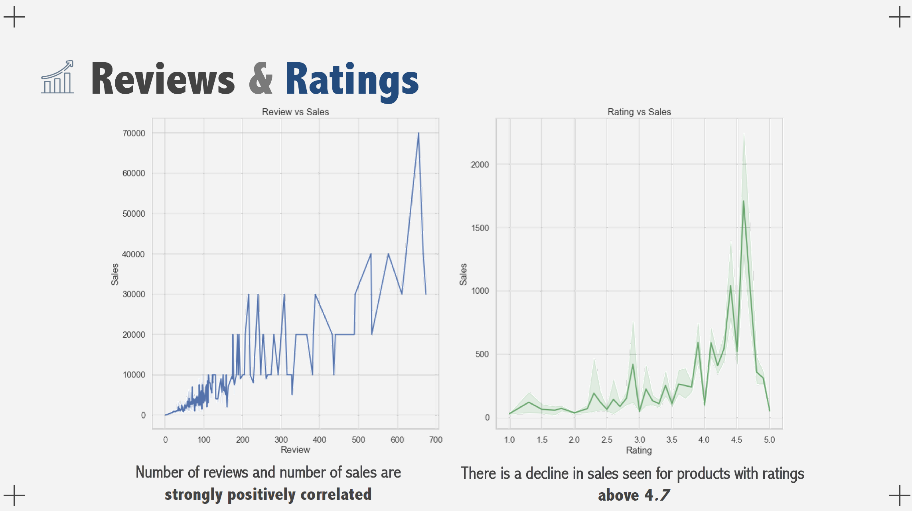
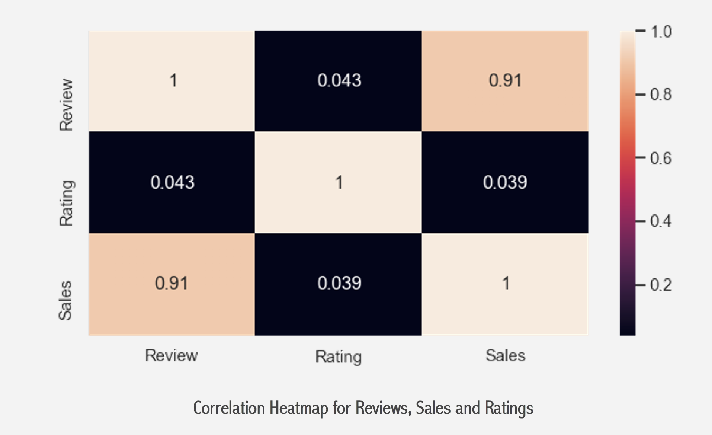
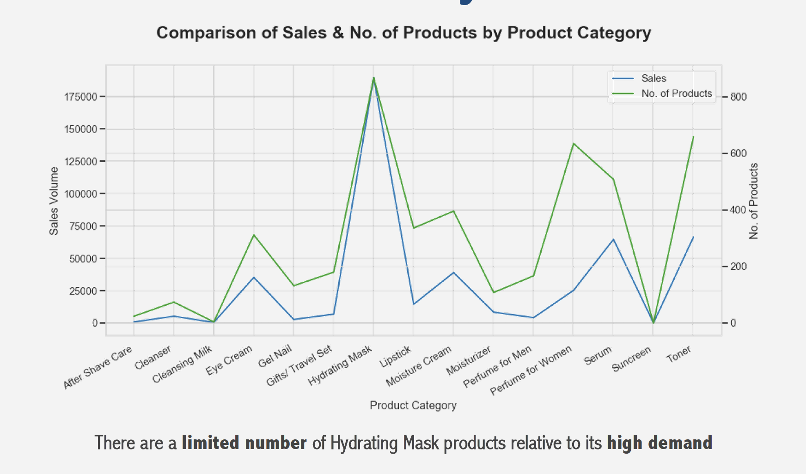
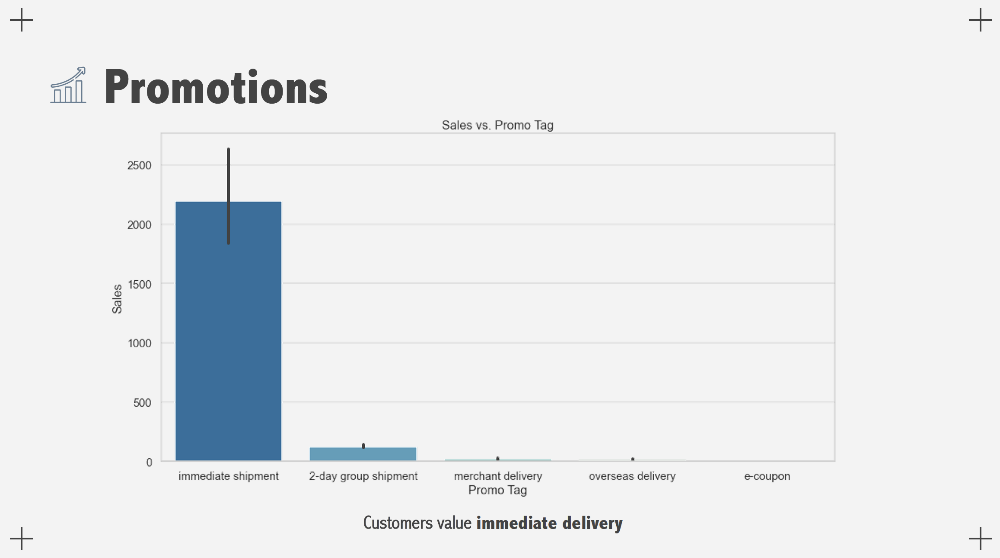
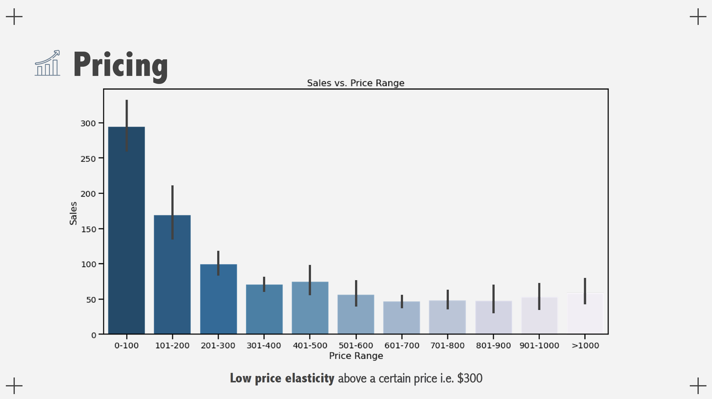
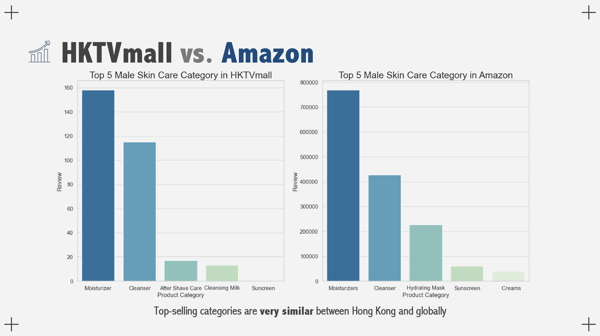

# Web Scraping Project - E-commerce Analysis of Skincare Product from HKTVmall & Amazon

## **--TBC not yet finished--**

## Project Overview

- Web scraped over 50,000 skincare products from HKTVmall and Amazon and preprocessed the data for analysis
- Constructed data frames and visualisations which identified gaps in the market and analysed consumer spending habits such as price elasticity of demand and effective types of promotions
- Made appropriate business recommendations according to the data-driven market insights

#### Aims

- Constructing a data frame with information collected via web scraping
- Analyzing the dataset and forming data-driven insights on a local market in Hong Kong

#### Business Objectives

- Identifying new opportunities
Are there in-demand products that are under-supplied?
Are there new audiences to target?

- Understanding Customer Needs
What do our customers want? How can we better cater to their needs?

- Determining Growth Factors
What are the biggest drivers of e-commerce sales?

## Data Collection & Preprocessing

1. Cast object to specified dtype
Astype – Price, Review, Rating

2. Extract useful string
Regex – Brand, Product

3. Replace missing values
Try, Except – NaN, 0

4. Extra Columns
Revenue, Product Category, Gender, % Discount

## Findings

#### Male vs Female
On average, female products were sold **twice** as much as male products, which means the skincare market is still **female-dominated** in Hong Kong

________________________________________________________________________________________________________________________

________________________________________________________________________________________________________________________

________________________________________________________________________________________________________________________

________________________________________________________________________________________________________________________

________________________________________________________________________________________________________________________

________________________________________________________________________________________________________________________

________________________________________________________________________________________________________________________

## Conclusion

## Recommendations

## 

